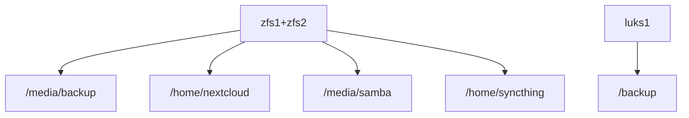
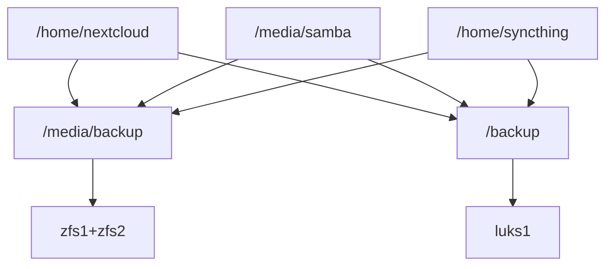

# Ansible Server
## Idea
Setup a custom server to provide a private-cloud and backup solution in a reproducible and almost automated way.
It is hard to keep track of the configuration of a custom server. By using ansible, every change is documented and reproducible.

## Comparable projects
- https://yunohost.org/#/
- https://github.com/davestephens/ansible-nas

## requirements
- a dynamic dns service (we use https://goip.de/ )
- (at least temporarily) port-forwarding of port 80 and 443 (in the router settings)
- a linux device to run the ansible playbooks in this github
- a server machine with 3-4 disks (see below)
- An email account for status emails (outlook works well)

## configured services
Ubuntu server is used as the base linux installation.
Apart from borgmatic (the backup solution), all services are ran as docker container.
- nginx (reverse proxy)
- Nextcloud (data synchronisation)
- Syncthing (data synchronisation for android devices)
- bookstack (wiki)
- pihole (ad blocking, custom dns)
- borgmatic (automated backup)

## disk setup and backups
The scripts assume a four disk setup.
- 64GB SSD to install the operating system
- two mirrored zfs devices as data storage (zfs1, zfs2). Size 3 times the size of the data to be stored
- a single device to store a copy of the backups (luks1). Half the size of the zfs devices/1.5 times the size of the data to be stored.

Visualization of the default disk layout:
mount points

backup archives data from/to

[Bormatic](https://torsion.org/borgmatic/) is used to create versioned archive of the data. Daily database dumps of the docker containers are also part of the backup.

The default backup will create an archived backup on the zfs devices - the same device where the data originally resides. (Storing on the same disk does not help against hardware errors but against accidental file deletion.)
A second archive is created on the luks1 device.

### scenarios of disk failure
The encryption keys and secrets used during creation should be stored separately to be able to decrypt the data.
- the system disk fails: Use the ansible playbooks to setup the server on a new disk. Minor adjustments are required to reuse the data.
- single zfs disk failure: replace the faulty disk. ZFS mirror will automatically replicate the data to the new disk.
- both zfs disks fails: replace the disks and restore the data from the luks1 disk.
- luks1 disk fails: replace the disk and either copy the borg archive from zfs or create a new borg archive.
- the server goes up in flames or malware encrypts the whole file system: This is why one should keep a separate disk at an external location. Swap out the luks or zfs disk in regular intervals.

To detect disk failures, the observe [the relevant SMART values](https://www.backblaze.com/blog/what-smart-stats-indicate-hard-drive-failures/).
These are checked and logged daily. An email is sent out if one of the values has changed.

## hardware/server
Points where you might differ:
- ECC RAM yes/no?
- suspend HDD yes/no?

There are many debates on whether ECC RAM is required or not.
I run a Intel G4400 with 16GB ECC RAM on a D3474-B mainboard.
Currently there is a lack of cheap and efficient CPUs with ECC support.

Dropping ECC support, one can get used desktop machines for cheap on ebay. For example, i bought an Fujitsu D756 for 60 Euro. By default it can host two 3.5 HDD and with a bit of tinkering a third can be added.

My setup consumes 24W in idle and 40W during load. If I enable powersaving for the HDDs, the idle load is 11W.
Suspending harddrives puts them under more stress and might shorten the life time.

To select proper hard drives, the [black blaze disk reports](https://www.backblaze.com/b2/hard-drive-test-data.html) provide details on reliability.
Huge thread on power consumption on [tweakers forum (Belgian)](https://gathering.tweakers.net/forum/list_messages/2096876).

## External exposure and pihole
To get letsencrypt certificates, portforwarding needs to be enabled. Afterwards, this can be disabled so that no data is exposed to the internet. 
To still access the docker container, for example nextcloud, one would need to write manual DNS entries on every machine -or- use a custom DNS server.
For example, Pihole is configured to resolve the docker URLS locally.

By default, pihole and syncthing are only available locally. (Add `NETWORK_ACCESS=INTERNAL` to the environment variables in the corresponding docker compose file.)

It is recommended to enable 2FA at least for the admin Nextcloud account.

## ToDos:
- [ ] Write this document
- [ ] detailed installation steps
- [ ] Could zfs snapshot feature replace borgmatic on zfs?
- [X] switch to yml variables
- [X] write hdd logs
- [ ] move secrets to /vault
- [ ] setup wikijs

- syncthing: run only locally <ip:8384>
- adjust hosts file if no outside exposure desired
    - still works with expired certs?

