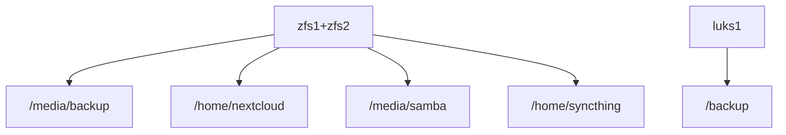
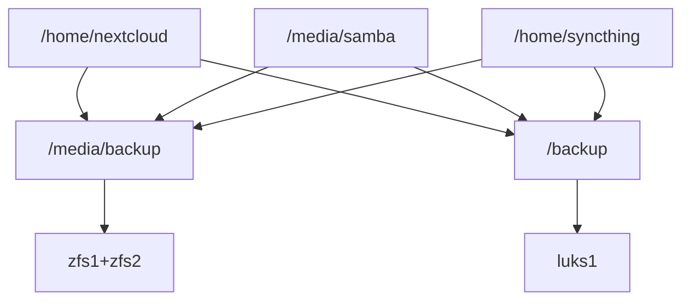

# Ansible Server
## Idea
Setup a custom server to provide a private-cloud and backup solution in a reproducible and nearly automated manner.

Maintaining the configuration of a customized server can be challenging.  [Ansible](https://www.ansible.com/overview/how-ansible-works) allows to replicate every modification done.
This compilation comprises Ansible playbooks, which enable the swift installation of a similar setup.

## Comparable projects
- https://yunohost.org/#/
- https://github.com/davestephens/ansible-nas

## requirements
- A dynamic DNS service (e.g., https://goip.de/) is required.
- Port forwarding of ports 80 and 443 (temporarily) must be configured in the router settings.
- A Linux device is necessary to execute the Ansible playbooks available in this GitHub repository.
- A server machine equipped with 3-4 disks (specified below).
- An email account to receive status updates (Outlook is a suitable option).

## Configured services
Ubuntu Server is utilized as the underlying Linux installation.
With the exception of borgmatic (the backup solution), all services are containerized using Docker and can be disabled if not needed.
- Nginx (reverse proxy)
- Nextcloud (data synchronization)
- Syncthing (data synchronization for Android devices)
- Bookstack (wiki)
- Pihole (ad blocking, custom DNS)
 - Borgmatic (automated backup)

## Disk Setup and Backups
The scripts assume a four-disk setup, as follows:
- 64GB SSD to install the operating system
- two mirrored zfs devices as data storage (zfs1, zfs2). Size 3 times the size of the data to be stored
- a single device to store a copy of the backups (luks1). Half the size of the zfs devices/1.5 times the size of the data to be stored.

Visualization of the default disk layout:
mount points

backup archives data from/to

[Bormatic](https://torsion.org/borgmatic/) is employed to create versioned archives of the data. Daily database dumps of the Docker containers are also included in the backup.

By default, an archived backup is created on the ZFS devices, which are the same devices where the data is originally stored. This approach does not mitigate hardware errors but safeguards against accidental file deletion. A second archive is created on the luks1 device.

### scenarios of disk failure
To decrypt the data, encryption keys and secrets used during creation should be stored and backuped separately.
Here are the scenarios in case of disk failure:
- System disk failure: In the event of system disk failure, utilize the Ansible playbooks to set up the server on a new disk. Minor adjustments are required to reuse the existing data.

- Single ZFS disk failure: If a single ZFS disk fails, replace the faulty disk. The ZFS mirror will automatically replicate the data to the new disk.

- Both ZFS disks fail: If both ZFS disks fail, replace the disks and restore the data from the luks1 disk.

- luks1 disk failure: In case of luks1 disk failure, replace the disk and either copy the Borg archive from ZFS or create a new Borg archive.

- Complete server failure or malware encrypting the entire file system: It is essential to maintain a separate disk at an external location. This allows for swapping out the luks or ZFS disk at regular intervals.

To detect disk failures, monitor the [relevant SMART values](https://www.backblaze.com/blog/what-smart-stats-indicate-hard-drive-failures/).
These values are checked and logged daily, and an email notification is sent if any changes occur.

## hardware/server
There are a few points where your preferences may differ:

- ECC RAM: There is an ongoing debate regarding the necessity of ECC RAM. In my setup, I use an Intel G4400 with 16GB ECC RAM on a D3474-B motherboard. Unfortunately, there is currently a scarcity of affordable and efficient CPUs with ECC support.

- Suspending HDD: You have the option to suspend the hard drives or not. However, keep in mind that suspending hard drives can put them under additional stress and potentially shorten their lifespan. In my setup, I consume 24W in idle and 40W during load while keeping the disks spinning. Enabling power-saving for the HDDs reduces the idle load to 11W.

Dropping ECC support, one can get used desktop machines for cheap on ebay. For example, i bought an Fujitsu D756 for 60 Euro. By default it can host two 3.5 HDD and with a bit of tinkering a third can be added.

To select suitable hard drives, refer to the [black blaze disk reports](https://www.backblaze.com/b2/hard-drive-test-data.html) for reliability details. Additionally, you can find extensive discussions on power consumption in a thread on the tweakers forum (Belgian)](https://gathering.tweakers.net/forum/list_messages/2096876).

## External exposure and pihole
To get letsencrypt certificates, portforwarding needs to be enabled. Afterwards, this can be disabled so that no data is exposed to the internet. 
To still access the docker container, for example nextcloud, one would need to write manual DNS entries on every machine -or- use a custom DNS server.
A
As a local DNS solution, Pihole is configured to resolve the Docker URLs. By default, Pihole and Syncthing are only accessible locally. To enforce this, add NETWORK_ACCESS=INTERNAL to the environment variables in the corresponding Docker Compose file.

For enhanced security, it is advised to enable two-factor authentication (2FA) for at least the admin account in Nextcloud.

## ToDos:
- [ ] Write this document
- [ ] detailed installation steps
- [ ] Could zfs snapshot feature replace borgmatic on zfs?
- [X] switch to yml variables
- [X] write hdd logs
- [ ] move secrets to /vault
- [ ] setup wikijs
- [ ] more sophistcated samba

- syncthing: run only locally <ip:8384>
- adjust hosts file if no outside exposure desired
    - still works with expired certs?

## TODOS
- write borg log path into /etc/environments
- copy check borg
- schedule check borg
- above only when borgmatic is enabled
